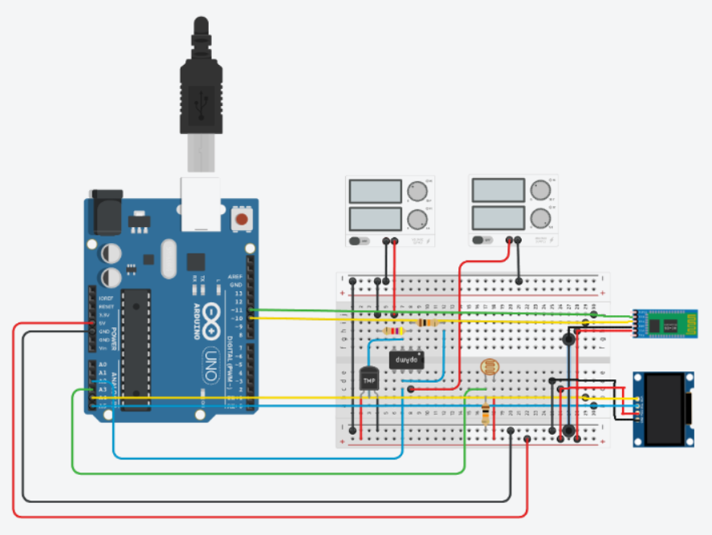

# BT-watch

The final project we did for the electronics module "Interaction électronique-logiciel

## overview :

this year, Niels Crolais and I had the opportunity to create and manage a small project using an Arduino Uno. We decided to build some kind of Bluetooth watch using an OLED screen, who can read temperature, adjust the display to the luminosity and output notification coming from a phone.

---

the project is done using [adafruit/Adafruit_SSD1306](https://github.com/adafruit/Adafruit_SSD1306?pseSrc=pgEcranOledArduino) library to communicate with a small Monochrome OLED screen based on SSD1306 drivers.

---

## components used:

- Arduino Uno rev 3

- photoresistor

- temperature sensor LM35

- a bunch of resistor (2x 10k, 1x 4,7k)

- an operational amplifier

- a small OLED 0,96'' display (SSD1306)

- a Bluetooth module HC-05 

---

## scheme :




---

## How to use:

the notification sent from the phone are done using a terminal, and must have the following syntax:

```
XXXXXyour message
```

where XXXXX represents the current timestamp in secondes times 10: 12:34 translates to $12\times360+34\times6 = 52044$ : it helps recalibrate the time of the "watch" as we did not have any RTC.
